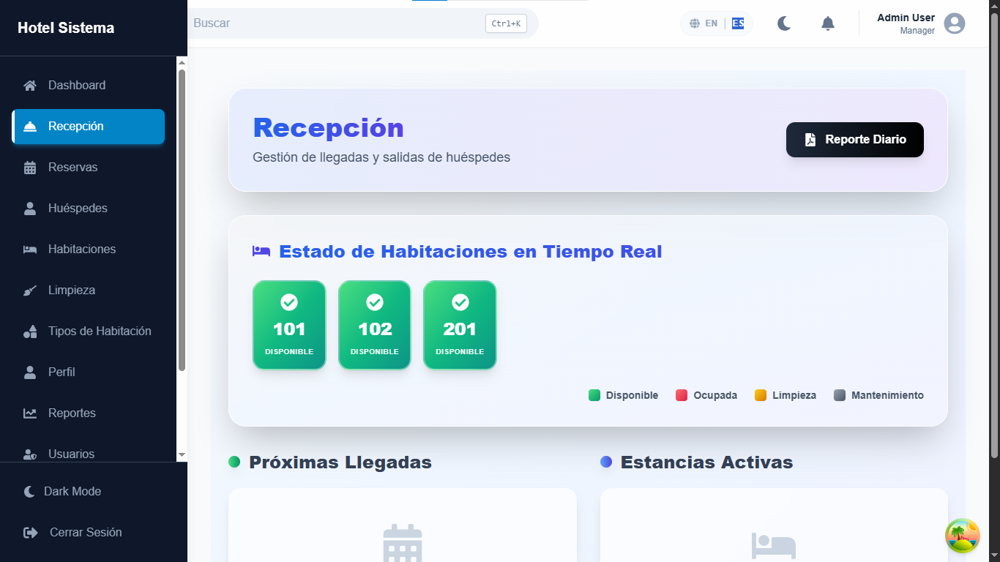
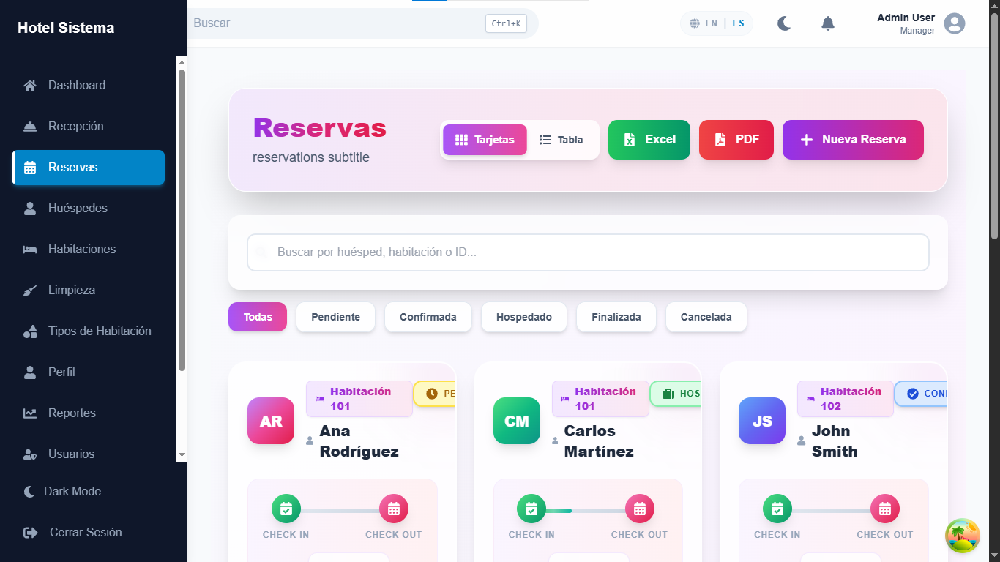

# Hotel Management System — PMS Full Stack

Sistema completo de gestión hotelera (Property Management System) con backend ASP.NET Core 10 y frontend React + TypeScript, construido con Clean Architecture y CQRS.

## Stack Tecnológico

### Backend
| Capa | Tecnología |
|------|-----------|
| Framework | ASP.NET Core 10 Web API |
| Arquitectura | Clean Architecture + CQRS (MediatR 14) |
| ORM | Entity Framework Core 10 + Dapper |
| Base de datos | SQL Server |
| Autenticación | JWT Bearer + ASP.NET Core Identity |
| Tiempo real | SignalR |
| Email | MailKit 4.14 (templates HTML) |
| Mapeo | AutoMapper 12 |
| Validación | FluentValidation 12 |
| Testing | xUnit + Moq + FluentAssertions |

### Frontend
| Capa | Tecnología |
|------|-----------|
| Framework | React 18 + TypeScript |
| Build tool | Vite |
| Estilos | Tailwind CSS |
| Estado | React Query (TanStack) |
| Gráficos | Recharts |
| i18n | Español / English |
| Exportación | PDF + Excel |

## Funcionalidades

### Módulos de la API (12 Controllers)
- **Auth** — Login con JWT, cambio de contraseña
- **Rooms** — CRUD de habitaciones con estados (Available, Occupied, Cleaning, Maintenance, Reserved)
- **Room Types** — Tipos de habitación con precio base y color identificador
- **Guests** — Gestión de huéspedes con activación/desactivación
- **Reservations** — Ciclo completo: crear → confirmar → check-in → check-out → cancelar. Búsqueda paginada avanzada
- **Front Desk** — Check-in y check-out rápido desde recepción
- **Dashboard** — KPIs en tiempo real: ocupación, ingresos, movimientos del día, comparación de períodos, gráfico de ingresos por fecha
- **Reports** — Reporte de ingresos por tipo de habitación, reporte de ocupación histórico, estadísticas de huéspedes
- **Audit** — Log completo de acciones del sistema (solo Admin): usuario, acción, entidad, IP, timestamp
- **Notifications** — Notificaciones en tiempo real vía SignalR, marcado leído/no leído
- **Settings** — Configuración de empresa, moneda, zona horaria, idioma, logo en base64
- **Users** — CRUD de usuarios con asignación de roles y toggle de estado

### Roles
| Rol | Permisos |
|-----|---------|
| Admin | Acceso completo + auditoría + usuarios |
| Staff | Operaciones de recepción y reservas |
| User | Consultas básicas |

## Base de Datos

**Motor:** SQL Server  
**Nombre:** `MiHoteleriaDB`

### Entidades principales
`Room` · `RoomType` · `Guest` · `Reservation` · `AuditLog` · `Notification` · `Settings` · `ApplicationUser`

Todas las entidades heredan de `Entity` (base con `Id: Guid`, `CreatedAt`, `LastModifiedAt`).

## Arquitectura

```
src/
├── HotelSystem.Domain/          # Entidades, enums, interfaces de repositorio
├── HotelSystem.Application/     # CQRS (Commands/Queries/Handlers), DTOs, AutoMapper
├── HotelSystem.Infrastructure/  # EF Core, Dapper, repos, Auth/Email/Audit/Dashboard services
├── HotelSystem.API/             # Controllers REST + NotificationHub (SignalR)
└── HotelSystem.Web/             # Frontend React + TypeScript + Vite + Tailwind

tests/
└── HotelSystem.UnitTests/       # xUnit + Moq + FluentAssertions
```

### Flujo de una solicitud
```
Controller → MediatR (Command/Query) → Handler → Service/Repository → EF Core → DB
                                                                     ↓
                                                              AutoMapper → DTO → Response
```

## Configuración y Puesta en Marcha

### Prerrequisitos
- .NET 10 SDK
- SQL Server (local o remoto)
- SMTP accesible (para emails, opcional)

### Pasos

1. Clonar el repositorio
2. Configurar `appsettings.json` en `HotelSystem.API`:
   ```json
   {
     "ConnectionStrings": {
       "DefaultConnection": "Server=TU_SERVIDOR;Database=MiHoteleriaDB;Trusted_Connection=True;TrustServerCertificate=True;MultipleActiveResultSets=true"
     },
     "JwtSettings": {
       "Key": "TU_CLAVE_SECRETA_MIN_32_CHARS",
       "Issuer": "HotelSystemApi",
       "Audience": "HotelSystemUsers",
       "DurationInMinutes": 60
     },
     "EmailSettings": {
       "SmtpServer": "smtp.gmail.com",
       "SmtpPort": 587,
       "SmtpUsername": "tu@email.com",
       "SmtpPassword": "tu_password",
       "FromEmail": "noreply@hotel.com",
       "FromName": "Hotel Management System",
       "EnableSsl": true,
       "AdminEmail": "admin@hotel.com"
     }
   }
   ```
3. Aplicar migraciones:
   ```bash
   cd src/HotelSystem.API
   dotnet ef database update
   ```
4. Ejecutar la API:
   ```bash
   dotnet run
   ```

La API corre en `https://localhost:5001`. Para el frontend React:
```bash
cd src/HotelSystem.Web
npm install
npm run dev
# Disponible en http://localhost:5173
```

### Credenciales por defecto
| Campo | Valor |
|-------|-------|
| Email | `admin@hotel.com` |
| Contraseña | `Pa$$w0rd!` |
| Rol | Admin |

## Endpoints principales

```
POST   /api/auth/login
GET    /api/rooms
POST   /api/reservations
POST   /api/reservations/{id}/checkin
POST   /api/reservations/{id}/checkout
GET    /api/dashboard/stats
GET    /api/reports/revenue
GET    /api/audit
       /hubs/notifications  (SignalR WebSocket)
```

## Capturas de Pantalla

### Dashboard React — KPIs y métricas


### Habitaciones — Estado en tiempo real


### Recepción — Check-in / Check-out


### Reservas


## Licencia

Proyecto de portafolio personal — uso educativo.
